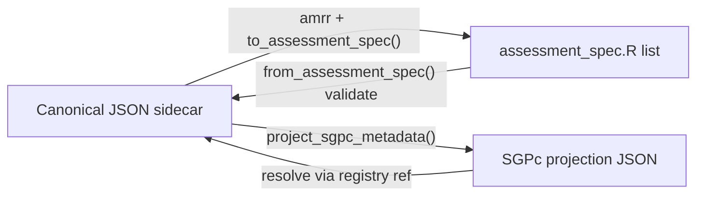

# Schema Crosswalk — Three Vocabularies to Five Domains

One-line summary: every field in `amr.assessment_system.v1`, `amr.accountability_system.v1`,
`sgpc.assessment_metadata.v0.1`, and colleague `assessment_spec.R` mapped to the canonical
five-domain taxonomy in [[metadata-taxonomy]], with conflicts, gaps, and reclassifications flagged.

## Legend

| Symbol | Meaning |
|--------|---------|
| **D1** | Jurisdiction identity |
| **D2** | Assessment-system identity |
| **D3** | Assessment (measurement) metadata |
| **D4** | Accountability (policy) metadata |
| **D5** | Governance / provenance |
| **OUT** | Consumer plumbing — not in federated registry |
| **RECLASS** | Field exists today but canonical home differs |
| **GAP** | Canonical target has this; source vocabulary lacks it |
| **CONFLICT** | Naming or shape mismatch requiring resolution |

Domain definitions: [[metadata-taxonomy]].

---

## A. `amr.assessment_system.v1` → canonical

| Source field | Domain | Canonical path | Notes |
|--------------|--------|----------------|-------|
| `schema_version` | D5 | `schema_version` | v1 → target `amr.assessment.v2`; legacy alias `sgpc.assessment_metadata.v0.1` retained during migration |
| `status` | D5 | `status` | |
| `source_confidence` | D5 | `source_confidence` | **GAP** in colleague spec (implicit via verification) |
| `provenance.*` | D5 | `provenance.*` | Colleague splits into `verification` + `source_documents` |
| `jurisdiction.id` | D1 | `jurisdiction.id` | Colleague: `program.state` |
| `jurisdiction.name` | D1 | `jurisdiction.name` | **GAP** in colleague spec |
| `jurisdiction.type` | D1 | `jurisdiction.type` | **GAP** in colleague spec |
| `jurisdiction.nces_id` | D1 | `jurisdiction.nces_id` | **GAP** in colleague + SGPc |
| `jurisdiction.fips` | D1 | `jurisdiction.fips` | **GAP** in colleague + SGPc |
| `assessment_system.id` | D2 | `assessment_system.id` | Derived in colleague from `program` + repo path |
| `assessment_system.name` | D2 | `assessment_system.name` | Colleague: `program.name` |
| `assessment_system.family` | D2 | `assessment_system.family` | **GAP** in colleague spec |
| `assessment_system.assessment_type` | D2 | `assessment_system.assessment_type` | **CONFLICT:** colleague `general`/`alternate`/`elp` vs registry free string (`english-language-proficiency`, etc.) — canonical enum in v2 |
| `administration.id` | D3 | `administration.id` | |
| `administration.year` | D3 | `administration.year` | Colleague: `program.administration_year` (integer) |
| `administration.vendor` | D3 | `administration.vendor` | Colleague: `program.vendor` |
| `administration.window` | D3 | `administration.window` | **GAP** in colleague spec |
| `administration.csem_ref` | D3 | `administration.csem_ref` | **GAP** in colleague spec |
| `assessment_program.*` | D2 | `assessment_program.*` | Colleague folds into `program`; **CONFLICT:** split vs monolithic `program` |
| `cutscores_provenance` | D5 | `cutscores_provenance` | Free-text; colleague uses per-cut `source` instead |
| `comparability.*` | D3 | `comparability.*` | **GAP** in colleague + SGPc sidecar |
| `content_areas[].id` | D3 | `content_areas[].id` | Colleague: `subjects` names |
| `content_areas[].label` | D3 | `content_areas[].label` | Colleague: `subjects.*.label` |
| `content_areas[].vertical_scale` | D3 | `content_areas[].vertical_scale` | **GAP** in colleague spec |
| `content_areas[].scale_name` | D3 | `content_areas[].scale_name` | **GAP** in colleague spec |
| *(missing)* | D3 | `content_areas[].grades` | **GAP** in registry v1 — colleague has `subjects.*.grades` |
| *(missing)* | D3 | `content_areas[].loss`, `.hoss` | **GAP** in registry v1 — colleague has in `scale_scores` |
| `achievement_levels.*.labels` | D3 | `achievement_levels.*.labels` | Colleague: flat `achievement_levels$labels` (one set per spec file) |
| `achievement_levels.*.proficient` | D3 | `achievement_levels.*.proficient` | Colleague: single `policy_benchmark` label — **CONFLICT**; canonical uses boolean mask |
| `cutscores` | D3 | `cutscores[content_area][grade]` | Colleague: `scale_scores` keyed `<SUBJECT>_<GRADE>` with embedded loss/hoss |
| `aliases` | D3 | `aliases` | **GAP** in colleague spec |
| `edfi.*` | D3 | `edfi.*` | **GAP** in colleague spec |
| `achievement_targets` | — | *(removed in v1)* | **RECLASS** → D4 accountability record; re-merged at read for SGPc |

---

## B. `amr.accountability_system.v1` → canonical

| Source field | Domain | Canonical path | Notes |
|--------------|--------|----------------|-------|
| `schema_version` | D5 | `schema_version` | Target `amr.accountability.v2` |
| `status` | D5 | `status` | |
| `source_confidence` | D5 | `source_confidence` | |
| `provenance.*` | D5 | `provenance.*` | |
| `jurisdiction.*` | D1 | `jurisdiction.*` | Same as assessment record |
| `accountability_system.id` | D4 | `accountability_system.id` | **GAP** in colleague spec (implicit state-year) |
| `accountability_system.name` | D4 | `accountability_system.name` | |
| `accountability_system.framework` | D4 | `accountability_system.framework` | **GAP** in colleague spec |
| `administration.id` | D4 | `administration.id` | |
| `administration.year` | D4 | `administration.year` | |
| `targets[].assessment_system_id` | D4 | `targets[].assessment_system_id` | Cross-link |
| `targets[].content_area` | D4 | `targets[].content_area` | |
| `targets[].label` | D4 | `targets[].label` | |
| `targets[].semantics` | D4 | `targets[].semantics` | `exit` \| `proficiency` |
| `targets[].basis` | D4 | `targets[].basis` | |
| `targets[].comparison` | D4 | `targets[].comparison` | |
| `targets[].per_grade_scale_score` | D4 | `targets[].per_grade_scale_score` | |
| `targets[].level_value` | D4 | `targets[].level_value` | deferred |
| `targets[].provenance` | D4 | `targets[].provenance` | |
| *(missing)* | D4 | `growth_targets` | **GAP** in registry v1 — colleague `elp$growth_targets` |
| *(missing)* | D4 | `timelines` | **GAP** in registry v1 — colleague `elp$timelines` |
| *(missing)* | D4 | `participation.*` | **GAP** in registry v1 — colleague `alternate$participation_criteria`, `federal_cap` |

---

## C. `sgpc.assessment_metadata.v0.1` → canonical

SGPc sidecar is a **narrow projection** of the assessment record (D1 + D2 + subset of D3 +
optional merged D4 targets at consumption). Fields map 1:1 to `amr.assessment_system.v1`
except where noted.

| Source field | Domain | In canonical assessment? | In SGPc projection? |
|--------------|--------|--------------------------|---------------------|
| `schema_version` | D5 | yes (alias) | yes |
| `jurisdiction.*` | D1 | yes | yes |
| `assessment_system.*` | D2 | yes | yes |
| `administration.*` | D3 | yes | yes |
| `assessment_program.*` | D2 | yes | yes |
| `content_areas[]` | D3 | yes | yes |
| `achievement_levels` | D3 | yes | yes |
| `cutscores` | D3 | yes | yes |
| `achievement_targets` | D4 | no (accountability record) | yes when re-merged by `amrr` |
| `aliases` | D3 | yes | optional |
| `edfi` | D3 | yes | yes |
| `status` / `provenance` / `comparability` | D5 / D3 | yes (registry only today) | optional in projection |
| `loss` / `hoss` / `grades` on content areas | D3 | target v2 | **GAP** — not required for SGPc engine today |

**SGPc-only consumption note:** the resolver (`resolve_sgpc_metadata`) needs jurisdiction,
system, year, content_areas, achievement_levels, cutscores, and optionally
`achievement_targets` — not demographics, column maps, or ELP extension blocks.

---

## D. Colleague `assessment_spec.R` → canonical

### D.1 Top-level and program

| Source field | Domain | Canonical path | Flag |
|--------------|--------|----------------|------|
| `schema_version` | D5 | `schema_version` | semver `"1.0.0"` vs registry URI-style |
| `program.name` | D2 | `assessment_program.assessment_name` + `assessment_system.name` | **CONFLICT** split |
| `program.short_name` | D2 | `assessment_program.abbreviation` | |
| `program.state` | D1 | `jurisdiction.id` | |
| `program.department` | D2 | `assessment_program.organization.name` | approximate |
| `program.assessment_type` | D2 | `assessment_system.assessment_type` | **CONFLICT** enum values |
| `program.administration_year` | D3 | `administration.year` | int vs string |
| `program.vendor` | D3 | `administration.vendor` | |

### D.2 Subjects, levels, scales

| Source field | Domain | Canonical path | Flag |
|--------------|--------|----------------|------|
| `subjects` (names) | D3 | `content_areas[].id` | **CONFLICT** `subjects` → `content_areas` |
| `subjects.*.label` | D3 | `content_areas[].label` | |
| `subjects.*.grades` | D3 | `content_areas[].grades` | **GAP** in registry v1 |
| `achievement_levels$labels` | D3 | `achievement_levels.*.labels` | colleague: one set; canonical: per content area |
| `achievement_levels$policy_benchmark` | D3 | *derived from* `achievement_levels.*.proficient` | **RECLASS** — not stored in canonical |
| `achievement_levels$data_column` | OUT | — | consumer plumbing |
| `scale_scores.*.loss` | D3 | `content_areas` or grade-cluster scale + `loss` | **GAP** in registry v1 |
| `scale_scores.*.hoss` | D3 | `content_areas` or grade-cluster scale + `hoss` | **GAP** in registry v1 |
| `scale_scores.*.cuts` | D3 | `cutscores[content_area][grade]` | key parsing `<SUBJECT>_<GRADE>` |
| `scale_scores.*.source` | D5 | per-cut or per-scale `source` in measurement | maps to `official`/`derived`/`provisional` |

### D.3 Years and data plumbing

| Source field | Domain | Canonical path | Flag |
|--------------|--------|----------------|------|
| `years$tested_years` | OUT | — | SGP / analysis config |
| `years$cohort_anchor_grade` | OUT | — | SGP / analysis config |
| `data$columns.*` | OUT | — | foundry ingest |
| `data$demographics_spec` | OUT | — | separate demographics file |

### D.4 Governance

| Source field | Domain | Canonical path | Flag |
|--------------|--------|----------------|------|
| `verification.status` | D5 | `status` | see state map in [[metadata-taxonomy]] |
| `verification.verified_by` | D5 | `provenance.entered_by` | approximate |
| `verification.verified_date` | D5 | `provenance.last_verified_at` | |
| `verification.method` | D5 | `provenance` extension or notes | |
| `verification.notes` | D5 | `provenance.changed_from_prior` or free note | |
| `source_documents[]` | D5 | `source_documents[]` | **GAP** in registry v1 (single citation only) |

### D.5 ELP extension → measurement + accountability split

| Source field | Domain | Canonical path | Flag |
|--------------|--------|----------------|------|
| `elp$instrument` | D3 | `measurement.elp.instrument` | **GAP** in registry v1 |
| `elp$domains` | D3 | `measurement.elp.domains` | |
| `elp$composites` | D3 | `measurement.elp.composites` | |
| `elp$composite_weights` | D3 | `measurement.elp.composite_weights` | |
| `elp$grade_clusters` | D3 | `measurement.elp.grade_clusters` | |
| `elp$band_scheme` | D3 | `measurement.elp.band_scheme` | |
| `elp$exit_criteria` | D4 | `targets[]` (`semantics: exit`) | **RECLASS** |
| `elp$growth_targets` | D4 | `growth_targets` | **RECLASS** |
| `elp$timelines` | D4 | `timelines` | **RECLASS** |

### D.6 Alternate extension → measurement + accountability split

| Source field | Domain | Canonical path | Flag |
|--------------|--------|----------------|------|
| `alternate$instrument` | D3 | `measurement.alternate.instrument` | **GAP** in registry v1 |
| `alternate$achievement_standard` | D3 | `measurement.alternate.achievement_standard` | |
| `alternate$scoring_model` | D3 | `measurement.alternate.scoring_model` | |
| `alternate$linkage_levels` | D3 | `measurement.alternate.linkage_levels` | |
| `alternate$equating_notes` | D3 | `measurement.alternate.equating_notes` | |
| `alternate$participation_criteria` | D4 | `participation.criteria` | **RECLASS** |
| `alternate$federal_cap` | D4 | `participation.federal_cap` | **RECLASS** |

---

## E. Conflict summary (must resolve in v2 ADR)

| Topic | Sources in tension | Canonical resolution |
|-------|-------------------|---------------------|
| Content identifier name | `subjects` vs `content_areas` | `content_areas` |
| Program identity shape | colleague `program` vs registry `assessment_system` + `assessment_program` | Keep split (D2) |
| Proficiency representation | `policy_benchmark` label vs `proficient[]` mask | Boolean mask; derive benchmark label |
| Scale envelope | cuts-only vs loss/hoss/cuts | Add loss/hoss to content area or scale object |
| Assessment type values | `general`/free string vs typed enum | Canonical enum + aliases |
| Governance shape | `verification` block vs `status`+`provenance` | Unified D5; document state map |
| Source evidence | single citation vs `source_documents[]` | List form in canonical |
| Exit / growth / timelines | inside ELP extension vs accountability record | D4 accountability (ADR-002 heuristic) |
| Achievement targets location | SGPc sidecar historical vs accountability | Accountability authored; merged at read |

---

## F. Gap summary (canonical v2 additions)

Fields the greenfield target adds beyond any single current vocabulary:

| Canonical addition | Primary donor |
|--------------------|---------------|
| `content_areas[].enrollment` + `scale_bounds[ca][grade]` | colleague `subjects` + `scale_scores` — *refined by ADR-009: bare `grades`/`loss`/`hoss` superseded by the enrollment block (fixed/variable instrument-vs-enrolled-grade model) and enrolled-grade-keyed scale bounds* |
| `measurement.elp.*` | colleague `elp` (measurement subset) |
| `measurement.alternate.*` | colleague `alternate` (measurement subset) |
| `growth_targets`, `timelines`, `participation` | colleague ELP/alternate extensions |
| `source_documents[]` | colleague spec |
| `comparability.*` | registry v1 (already present) |
| `edfi.*` | registry / SGPc |
| Per-cut `source` on scale entries | colleague `scale_scores.*.source` |

---

## G. Round-trip sketch

Implementation of `to_assessment_spec()` / `from_assessment_spec()` / `project_sgpc_metadata()`
is **out of scope** for this analysis — deferred to a post-sign-off implementation ADR.

---

## Related pages

- [[metadata-taxonomy]] — domain definitions and naming rules
- [[008-unified-metadata-taxonomy]] — ADR adopting this model
- [[colleague-assessment-spec-r]] — source summary
- [[002-accountability-system-record]] — target relocation precedent
- [[sgpc-registry-consumption-contract]] — SGPc projection contract
