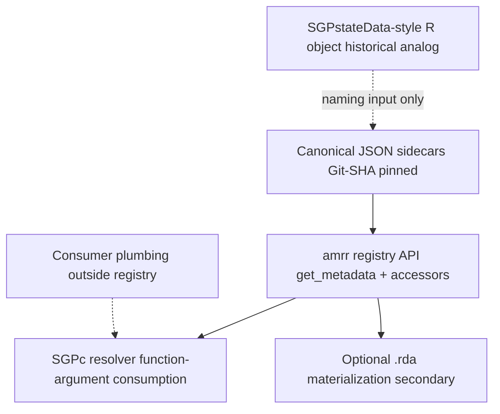

# ADR-008: Unified Metadata Taxonomy (Greenfield Target Model)

**Status:** Accepted (sign-off Damian Betebenner, 2026-07-06; colleague confirmed API-first
consumption — query + accessors + optional `.rda` materialization — in place of sourced
`.R` spec files. Near-term proof point: SGPc sidecar consumption.)
**Date:** 2026-07-03

## Context

Three overlapping metadata vocabularies now describe the same underlying facts:

1. **Registry** — `amr.assessment_system.v1` + `amr.accountability_system.v1` (JSON sidecars,
   Git-SHA pinned, SGPc-first consumer via `amrr`).
2. **SGPc sidecar** — `sgpc.assessment_metadata.v0.1` (narrow analysis projection; legacy alias
   of the assessment schema).
3. **Colleague R spec** — unified `assessment_spec.R` (typed list, one file per
   `STATE × YEAR × TYPE`, general / alternate / ELP discriminator, validation + manifest tooling).

The colleague's `assessment_spec.R` is best understood as an attempt to structure state
assessment metadata the way **SGPstateData** does: a sourced R object you load and access
directly. That pattern served embedded, package-local metadata well, but it is **not** the
primary consumption model for this registry.

ADR-002 already separated **measurement** (assessment record) from **policy** (accountability
record). The colleague's spec and historical SGPstateData-style embeddings add valuable
structure — `loss`/`hoss`, per-subject grades, ELP/alternate extensions, verification workflow,
separated demographics — but also re-mingle policy facts (ELP exit, growth, timelines) inside
measurement-shaped blocks.

The dilemma is therefore not "JSON vs R object" as co-equal authoring paths. It is:

- **First:** agree on an acceptable naming convention and domain taxonomy across the early
  registry work and the colleague's vocabulary (see [[schema-crosswalk]]).
- **Second:** make the **registry API** (via `amrr`) the primary interface — consumers pass
  arguments to R functions and receive resolved facts, the same way SGPc will consume metadata
  from the registry — rather than maintaining a parallel R-object layer that must be sourced,
  validated, and kept in sync.
- **Optionally:** materialize API responses into R objects or binary artifacts (`.rda`) for
  embedding in other packages — a **secondary** export path, not the canonical authoring model.

Building against the registry API should be strictly easier than authoring a standalone R spec
file and then parsing equivalent JSON returned from a query: one source of truth, one vocabulary,
no duplicate maintenance.

## Decision

### 1. Adopt a five-domain taxonomy as the canonical organizing principle

Every metadata fact belongs to exactly one domain (full definitions: [[metadata-taxonomy]]):

| Domain | Record home |
|--------|-------------|
| D1 Jurisdiction identity | Both record types |
| D2 Assessment-system identity | Assessment record (invariant across years) |
| D3 Assessment (measurement) metadata | Assessment record (year-resolved) |
| D4 Accountability (policy) metadata | Accountability record (year-resolved, cross-linked) |
| D5 Governance / provenance | Both record types (cross-cutting) |

**Consumer plumbing is explicitly excluded** from the federated registry: `data.columns`,
`demographics_spec`, `years.tested_years`, cohort anchors, and SGPc analysis configuration.

### 2. Greenfield target schemas supersede v1 as the long-term canonical contract

Target schema identifiers (implementation deferred):

- `amr.assessment.v2` — supersedes `amr.assessment_system.v1`
- `amr.accountability.v2` — supersedes `amr.accountability_system.v1`

v1 remains valid until a follow-up implementation ADR lands migration tooling. During transition,
v1 records validate; v2 adds fields from the crosswalk gap analysis without breaking the
SGPc projection subset.

### 3. Consumption priority — naming first, API second, R-object materialization third

Work proceeds in this order:

| Priority | What | Why |
|----------|------|-----|
| **1 — Naming & taxonomy** | Align vocabulary across registry `amr.*`, SGPc sidecar, and colleague spec ([[schema-crosswalk]]) | Without agreed names and domain boundaries, every consumer fork diverges |
| **2 — Registry API via `amrr`** | Function-argument queries (`get_metadata()`, accessors) returning resolved records | Primary consumption path for SGPc and other R workflows; no parallel object layer required |
| **3 — Optional materialization** | Serialize API responses to R lists or binary (`.rda`) for package embedding | Secondary export for legacy/SGPstateData-style consumers; derived from API bytes, not authored independently |

The `amrr` package is the R client to the registry — not primarily a JSON-to-R-object
converter for a parallel authoring repo. Its growth path:

1. **Query surface** — pass jurisdiction, system, year (and options such as `attach_targets`,
   `ref` for SHA pinning) to functions; receive resolved metadata suitable for direct use in
   analysis pipelines (see [[sgpc-registry-consumption-contract]]).
2. **Accessor surface** — thin helpers (`amrr_cutscores()`, `amrr_targets()`, etc.) so callers
   need not navigate raw list structure.
3. **Materialization surface (secondary)** — take the object returned by `get_metadata()` and
   persist it as a binary artifact embeddable in another R package, when a consumer truly
   needs offline/local embedding. The binary is a **cache of registry bytes at a pinned SHA**,
   not an alternate source of truth.

### 4. Projection model — canonical JSON, API-mediated access

| Layer | Role |
|-------|------|
| **Canonical JSON** | Authoritative; Git commit SHA is the reproducibility pin |
| **`amrr` API** | Primary R interface; function arguments in, resolved records out |
| **SGPc projection** | Narrow subset consumed by the copula engine (+ targets re-merged at read) |
| **Binary materialization** | Optional offline embed; must record the registry SHA it was derived from |
| **Colleague `assessment_spec.R`** | Historical analog to SGPstateData; informs naming and field coverage, **not** a co-equal authoring target |

**Rule (federation):** a fact is authored once in canonical JSON. Everything else — API
responses, SGPc sidecar projections, `.rda` binaries — is derived from those bytes.

**Rule (consumption):** consumers should call the registry API (directly or via SGPc's
`registry` resolver source) rather than maintaining a parallel R spec repo that duplicates
the same facts in a different shape.

### 5. Naming and structural resolutions

Adopt these canonical names (detail in [[schema-crosswalk]]):

| Topic | Decision |
|-------|----------|
| Content identifiers | `content_areas` (not `subjects`); retain legacy names in `aliases` |
| Program identity | Keep `assessment_system` + `assessment_program` split (not monolithic `program`) |
| Scale envelope | Add `grades`, `loss`, `hoss` to content-area (or ELP grade-cluster) objects; `cutscores` remain `content_area → grade → []` |
| Proficiency | Boolean `proficient[]` mask per content area; `policy_benchmark` is a **derived** label, not stored |
| Assessment type | Enum discriminator: `summative`, `alternate`, `elp`, `science`, `end-of-course`; conditional `measurement.elp` / `measurement.alternate` extension blocks |
| Governance | Unified `status` + `provenance` + `source_documents[]`; map colleague `verification.status` per [[metadata-taxonomy]] |
| Per-value confidence | `official` / `derived` / `provisional` on individual cut/scale entries |

### 6. Reclassify policy facts out of measurement extensions

Following ADR-002's heuristic ("state decision about *using* scores → accountability"):

| From colleague spec | Canonical home |
|---------------------|----------------|
| `elp$exit_criteria` | `targets[]` (`semantics: exit`) |
| `elp$growth_targets` | `growth_targets` |
| `elp$timelines` | `timelines` |
| `alternate$participation_criteria` | `participation.criteria` |
| `alternate$federal_cap` | `participation.federal_cap` |

Measurement extensions retain vendor/psychometric facts only (domains, composites, weights,
band_scheme, scoring_model, linkage_levels, equating_notes).

SGPc continues to receive merged `achievement_targets` at read time
(`amrr::get_metadata(..., attach_targets = TRUE)`) — unchanged consumption ergonomics.

### 7. Demographics and column mappings stay out of scope

The colleague's separation of `demographics_spec` is **endorsed**. Demographics definitions
may eventually live in their own registry or file tree; they are not part of
`amr.assessment.v2`. Column mappings (`data.columns`) belong to foundry ingest or state
project configs.

### 8. This ADR is design-only

No schema JSON, metadata records, or R packages are modified by this decision. Deliverables
are wiki artifacts only:

- [[metadata-taxonomy]] (pattern)
- [[schema-crosswalk]] (analysis)
- [[colleague-assessment-spec-r]] (source)

Implementation requires a **follow-up ADR** after sign-off, in priority order:

1. `amr.assessment.v2` / `amr.accountability.v2` JSON Schemas and v1 migration tooling.
2. `amrr` API extensions: query + accessor surface for SGPc and general R consumers.
3. Optional `amrr` materialization helpers (e.g. persist pinned snapshot to `.rda`).
4. SGPc-side `registry` resolver wiring (already sketched in [[sgpc-registry-consumption-contract]]).

Explicitly **not** a follow-up priority: building a parallel `to_assessment_spec()` /
round-trip authoring layer that treats the colleague's R list as a co-equal canonical format.
The colleague's vocabulary informs the crosswalk; consumption goes through the API.

## Alternatives considered

| Alternative | Why not chosen |
|-------------|----------------|
| Registry v1 as canonical superset; colleague spec as consumer only | Leaves naming conflicts unresolved; does not absorb ELP/alternate/loss-hoss structure |
| Colleague R list as canonical; JSON as export | Breaks Git-SHA JSON sidecar model, Ed-Fi alignment, and non-R consumers |
| R spec repo as co-equal authoring path alongside JSON | Duplicates facts; forces sync between sourced `.R` files and registry sidecars |
| Independent crosswalk only, no unified target | Perpetuates three forks; does not give a migration north star |
| Single monolithic record (assessment + accountability merged) | Violates ADR-002; obscures measurement vs policy boundary |
| JSON → R object conversion as primary `amrr` purpose | Inverts the consumption model; API query + accessors should be primary |

## Consequences

- **Positive:** One vocabulary, clear domain boundaries; colleague contributions (type
  discriminator, extensions, verification) have a defined canonical home in JSON, accessed
  via `amrr`.
- **Positive:** SGPc consumes metadata through function arguments to the registry API — the
  same pattern general R consumers should adopt — rather than embedding parallel spec objects.
- **Positive:** SGPstateData-style needs (offline package embedding) are served by optional
  binary materialization from pinned API responses, not by maintaining a second authoring repo.
- **Positive:** SGPc sidecar remains intentionally narrow — the "not everything" answer is
  structural (projection), not ad hoc omission.
- **Neutral:** v1 corpus and tooling remain operational until v2 implementation ADR.
- **Risk:** Greenfield target may drift if implementation is delayed — mitigate by keeping
  crosswalk updated as v1 corpus grows.
- **Risk:** Colleague may initially prefer the familiar sourced-R-object workflow — mitigate
  by demonstrating that API calls with accessors replace the need to author and sync `.R` spec
  files.
- **Follow-up:** Implementation ADR in priority order: v2 schemas → `amrr` API/accessors →
  optional materialization → SGPc resolver wiring.

## Related

- [[000-registry-architecture]] · [[001-assessment-system-schema]] · [[002-accountability-system-record]]
- [[metadata-taxonomy]] · [[schema-crosswalk]] · [[colleague-assessment-spec-r]]
- [[sgpc-registry-consumption-contract]]
- SGPc: [[instantiation:SGPc-rpkg/SGPc/wiki/decisions/011-assessment-metadata-layer]]
