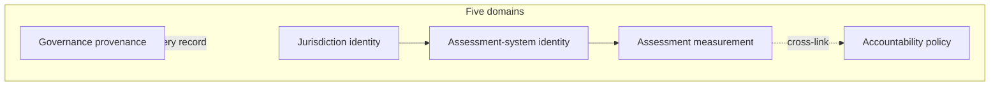
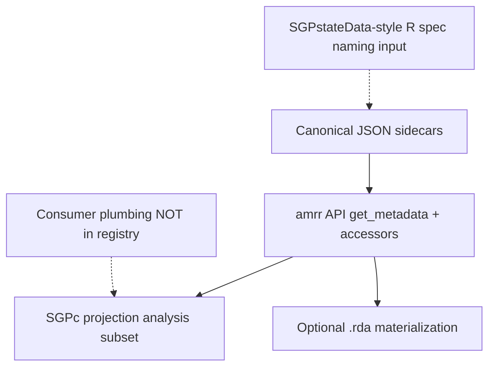

# Metadata Taxonomy — Five Domains and Projection Layers

One-line summary: every assessment-metadata fact belongs to exactly one of five domains;
canonical JSON records are the superset; SGPc sidecars and typed R specs are narrow or
ergonomic projections — not alternate sources of truth.

## Why five domains

[[002-accountability-system-record]] established the assessment vs accountability cut.
This pattern extends that into a full taxonomy so three overlapping vocabularies (registry
`amr.*`, SGPc sidecar, colleague `assessment_spec.R`) can converge without duplicating
facts or mixing measurement with policy.

## Domain definitions

### 1. Jurisdiction identity

**What:** Who operates the assessment/accountability system (state, territory, consortium).

**Invariant across years** within a jurisdiction id.

| Canonical field | Notes |
|-----------------|-------|
| `jurisdiction.id` | Short code (`IN`, `SD`) |
| `jurisdiction.name` | Display name |
| `jurisdiction.type` | `state` \| `territory` \| `consortium` \| `district` \| `other` |
| `jurisdiction.nces_id` | Optional NCES identifier |
| `jurisdiction.fips` | Optional FIPS code |

**Does not belong here:** vendor, cutscores, exit thresholds, data column names.

### 2. Assessment-system identity

**What:** Durable identity of *which test program* this is — independent of a single
administration year.

| Canonical field | Notes |
|-----------------|-------|
| `assessment_system.id` | Stable slug (`wida-access`, `ilearn`) |
| `assessment_system.name` | Display name |
| `assessment_system.family` | Product line / consortium family |
| `assessment_system.assessment_type` | Discriminator — see below |
| `assessment_program.*` | Program name, abbreviation, sponsoring organization |

**Assessment type discriminator (canonical enum):**

| Value | Meaning | Extension block |
|-------|---------|-----------------|
| `summative` | General state summative (+ EOC) | — |
| `alternate` | Alternate achievement standards | `measurement.alternate` |
| `elp` | English language proficiency | `measurement.elp` |
| `science` | Standalone science (when not bundled in summative) | — |
| `end-of-course` | EOC-only when modeled separately | — |

Map colleague `general` → `summative`; keep `alternate` and `elp` as-is.

**Does not belong here:** year-specific cutscores, comparability flags, accountability targets.

### 3. Assessment (measurement) metadata

**What:** Year-resolved facts from standard-setting, the vendor, or psychometric documentation.
If a fact would be the same in every state using WIDA ACCESS, it is still *measurement* —
but state-specific overrides (e.g. which composite is reported) stay here only when they
describe the score itself, not how the state uses it for accountability.

| Sub-block | Canonical contents |
|-----------|-------------------|
| `administration` | `id`, `year`, `vendor`, `window`, `csem_ref` |
| `content_areas[]` | `id`, `label`, `vertical_scale`, `scale_name`, `enrollment` (`intended_enrollment_grade: fixed|variable`, `enrolled_grades_tested[]`, `note`) — see ADR-009 |
| `scale_bounds` | `content_area → enrolled grade → {loss, hoss, source}` (mirrors `cutscores` keying) |
| `achievement_levels` | Per content area: `labels[]`, `proficient[]` (boolean mask) |
| `cutscores` | `content_area → grade → number[]` (strictly increasing; count = n_levels − 1) |
| `comparability` | `comparable_to_prior_year`, `scale_transition`, `prior_scale_name`, `administered`, `notes` |
| `aliases` | Canonical id → alternate names/codes |
| `edfi` | Optional Ed-Fi descriptor crosswalk overrides |
| `measurement.elp` | domains, composites, weights, grade_clusters, band_scheme |
| `measurement.alternate` | instrument, achievement_standard, scoring_model, linkage_levels, equating_notes |

**Heuristic (from ADR-002):** if the fact comes from **standard-setting or the vendor**,
it is measurement metadata.

**Does not belong here:** ELP exit thresholds, growth targets, participation caps for
accountability, proficiency *policy* targets, SGP column mappings.

### 4. Accountability (policy) metadata

**What:** Year-resolved **state decisions** about how scores are used — exit,
proficiency goals, growth expectations, participation rules.

**Record type:** separate sidecar keyed `jurisdiction × accountability_system × year`.
Each policy fact **cross-links** `assessment_system_id` + `content_area`.

| Sub-block | Canonical contents |
|-----------|-------------------|
| `accountability_system` | `id`, `name`, `framework` (e.g. ESSA) |
| `targets[]` | `semantics` (exit \| proficiency), `basis`, `comparison`, thresholds |
| `growth_targets` | Expected growth toward exit/proficiency (from colleague `elp$growth_targets`) |
| `timelines` | Max years to exit, on-time rules, LTEL definition |
| `participation` | Alternate participation criteria, federal 1% cap |
| *(future)* | N-size, indicator weights, business rules |

**Heuristic:** if the fact is a **state decision about using scores**, it is accountability.

**Reclassifications from colleague spec:**

| Colleague field | Canonical home |
|-----------------|----------------|
| `elp$exit_criteria` | `targets[]` with `semantics: exit` |
| `elp$growth_targets` | `growth_targets` |
| `elp$timelines` | `timelines` |
| `alternate$participation_criteria` | `participation` |
| `alternate$federal_cap` | `participation.federal_cap` |
| `achievement_levels$policy_benchmark` | *Derived* from measurement `proficient` mask |

At consumption time (e.g. `amrr::get_metadata(..., attach_targets = TRUE)`), resolved
targets may be **re-merged** onto the assessment projection for SGPc — a read-time view,
not an authoring location.

### 5. Governance / provenance (cross-cutting)

**What:** Trust, authorship, and evidence for every record — assessment or accountability.

| Canonical field | Notes |
|-----------------|-------|
| `status` | `draft` \| `reviewed` \| `verified` \| `deprecated` |
| `source_confidence` | `low` \| `medium` \| `high` |
| `provenance.entered_by` | Author; machine drafts use `ai:<harness-id>` |
| `provenance.entered_at` | ISO date |
| `provenance.last_verified_at` | Optional |
| `provenance.changed_from_prior` | What changed vs prior year/commit |
| `source_documents[]` | `{title, url}` list (url may be null) |
| `cutscores_provenance` | Free-text note on cut block specifically (retained) |

Per-cut value confidence (`official` / `derived` / `provisional`) lives on individual
cutscore or scale entries in measurement metadata.

**Verification state map** (colleague → canonical):

| Colleague `verification.status` | Canonical `status` |
|--------------------------------|-------------------|
| `unverified` | `draft` |
| `auto_derived` | `draft` (+ `source_confidence: low`) |
| `in_review` | `reviewed` |
| `human_verified` | `verified` |

## Explicitly outside the registry

These belong to **consumer plumbing** — SGPc analysis specs, foundry ingest scripts, or the
colleague's R repo — not the federated metadata product:

| Field / concept | Typical consumer |
|-----------------|------------------|
| `data.columns` | Foundry / state ingest |
| `demographics_spec` | Separate demographics registry or file |
| `years.tested_years`, `cohort_anchor_grade` | SGP / growth analysis config |
| SGPc `design`, copula families, condition templates | SGPc analysis spec only |

## Projection layers

Per [[008-unified-metadata-taxonomy]], consumption priority is: **naming alignment → registry
API via `amrr` → optional binary materialization**. The colleague's `assessment_spec.R` is a
SGPstateData-style analog that informs naming; it is not a co-equal authoring target.

| Layer | Role | Carries |
|-------|------|---------|
| **Canonical** | Single source of truth; Git-SHA pinned | Full five domains (split across record types) |
| **`amrr` API** | Primary R interface; function arguments in, resolved records out | Query + accessor surface for all consumers |
| **SGPc projection** | Copula engine input | Jurisdiction, system, administration, content_areas, levels, cuts, merged targets, edfi, comparability |
| **Binary materialization** | Optional offline embed from pinned API response | Cache of registry bytes at a SHA — not alternate authorship |
| **Plumbing** | Never federated | Column maps, demographics paths, SGP config |

**Rule:** a fact is authored once in canonical JSON. API responses, projections, and binaries
are **derived views**, never independent forks.

## Naming conventions (canonical)

| Topic | Convention |
|-------|------------|
| Content identifiers | `content_areas[].id` — UPPER_SNAKE or vendor codes; use `aliases` for legacy names |
| Prefer | `content_areas` over `subjects` |
| Scale bounds | `scale_bounds[content_area][enrolled grade]` = `{loss, hoss, source}` (ADR-009; supersedes content-area-level loss/hoss) |
| Cuts | `cutscores[content_area][grade]` as numeric array — **grade keys are always enrolled grades**, never instrument/form names |
| Enrollment | `content_areas[].enrollment` distinguishes instrument target (`fixed`/`variable`) from `enrolled_grades_tested[]` (ADR-009) |
| Proficiency | Boolean `proficient[]` mask aligned to `labels[]`; do not store a lone `policy_benchmark` in canonical form |
| Record filenames | `<system>-<jurisdiction>-<year>.json` under `metadata/<jur>/<system>/` |
| Schema version strings | `amr.assessment.v2`, `amr.accountability.v2` (target; v1 remains until migration ADR) |

## Quick "belongs here?" checklist

1. Would two states using the same vendor test share this fact unchanged? → Likely **measurement** (possibly with state-specific content_area ids).
2. Does Indiana's exit rule differ from Ohio's on the same WIDA scale? → **Accountability**.
3. Is this about which column in the LONG file is `scale_score`? → **Consumer plumbing**.
4. Did this value come from a technical manual table? → **Measurement** + governance citation.
5. Did the state board set this threshold for ESSA? → **Accountability**.

## Related pages

- [[008-unified-metadata-taxonomy]] — ADR adopting this taxonomy
- [[schema-crosswalk]] — field-level mapping from all three vocabularies
- [[002-accountability-system-record]] — assessment vs accountability split
- [[sgpc-registry-consumption-contract]] — SGPc projection and target re-merge
